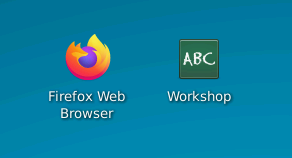
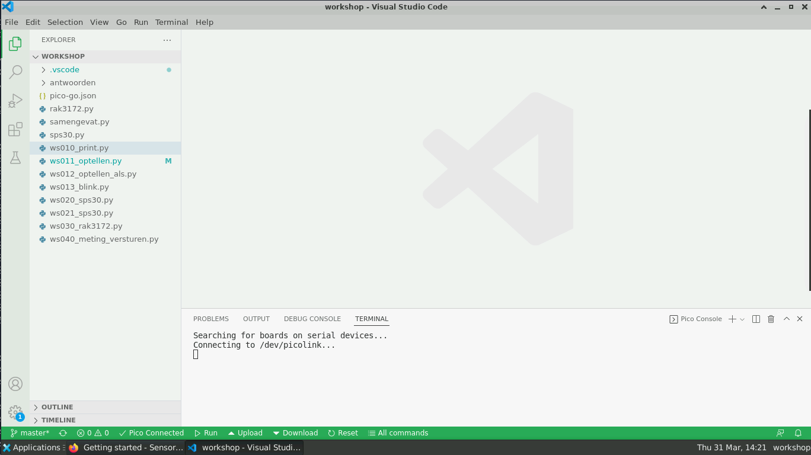
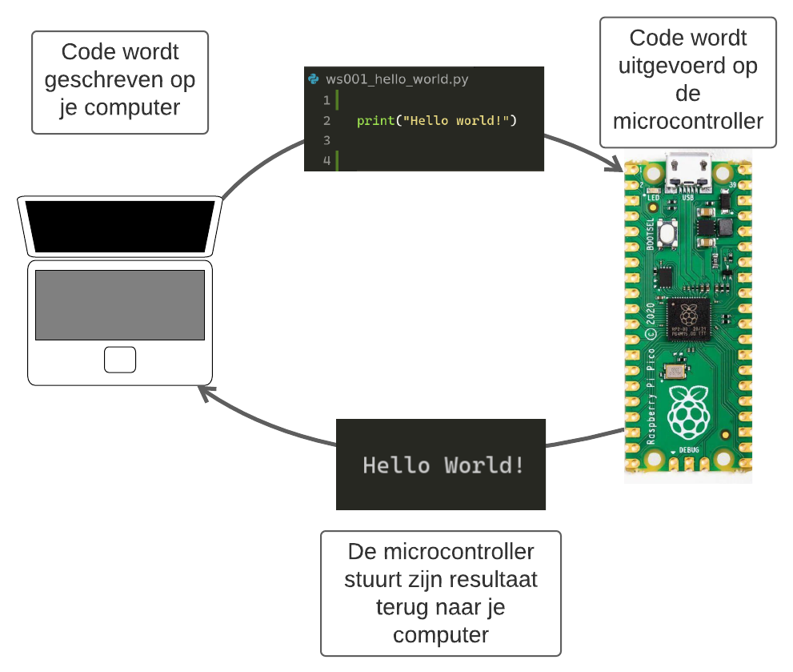

# Omgeving testen

!!! Benodigdheden
    Zorg dat je in de online werkplek bent ingelogd en dat je de USB kabel met de microcontroller bij de hand hebt

In deze stap gaan we kijken of we een stukje code kunnen laten uitvoeren op de microcontroller. Als dit lukt dan weten we dat alles gereed staat en werkt, en kunnen we verder met de workshop.

## Ontwikkelomgeving openen

Begin met het openen van de ontwikkelomgeving. Ter gemak staat er een bestand op het bureaublad genaamd "Workshop", deze opent automatisch de ontwikkelomgeving in de juiste folder.

<figure markdown="1">

</figure>

Na het openen van dit bestand krijg je een scherm met de ontwikkelomgeving. Dit is eigenlijk een tekst-bewerker met veel extratjes. Hier een korte uitleg:

1. In de linker zijbalk zie je een lijst aan bestanden;
2. klik op een bestand in de zijbalk om deze te openen;
3. het geopende bestand is in het midden van je scherm zichtbaar;
4. als er meerdere bestanden open staan worden dit tabbladen;
5. staat er een bolletje bij de naam van het tablad? Gebruikt dan CTRL+S om het bestand op te slaan;
6. onderaan het scherm is een tab "Terminal". Hierin komt de verbinding met de microcontroller te staan, dus als de microcontroller iets "zegt" zal dit hier verschijnen.

<figure markdown="1">

</figure>

## Hallo wereld uitvoeren

??? note "Geen Run knop, of Pico Disconnected?"

    Staat er in de groene balk "Pico disconnected"? Dan is de ontwikkelomgeving niet goed verbonden met de microcontroller. Klik op de "Pico disconnected" tekst om opnieuw verbinding te maken.

Tijd om je eerste code uit te voeren op de microcontroller:

1. Zorg dat je de ontwikkelomgeving open hebt staan;
2. open het bestand *ws010_print.py*;
3. klik op de "Run" knop in de groene balk.

<figure markdown="1">
{ width=700 }
</figure>

De code die openstaat zal nu verstuurd worden naar de microcontroller en zal daar uitgevoerd worden. In dit geval wordt de microcontroller gecommandeerd om de tekst "Hallo wereld" terug te sturen naar de computer. Als het goed is verschijnt dit ook in de het onderste venster (de terminal).

## Wat is er gebeurd?

In de onderstaande afbeelding is weergegeven wat er gebeurde toen je op "Run" klikte.

De code die je verstuurde commandeerde de microcontroller om de tekst "Hallo wereld" terug te sturen. Dit gebeurde door de functie `#!python print("Hallo wereld")` aan te roepen.

<figure markdown="1">
{ width=700 }
<figcaption>Hoe de code uitgevoerd word op de microcontroller</figcaption>
</figure>
