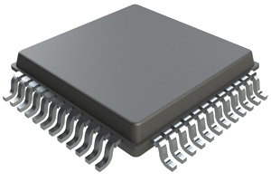
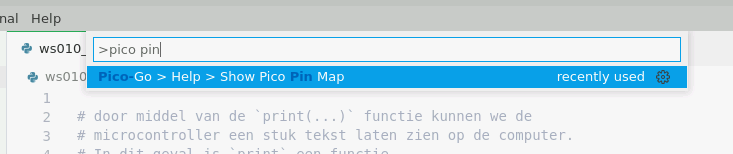
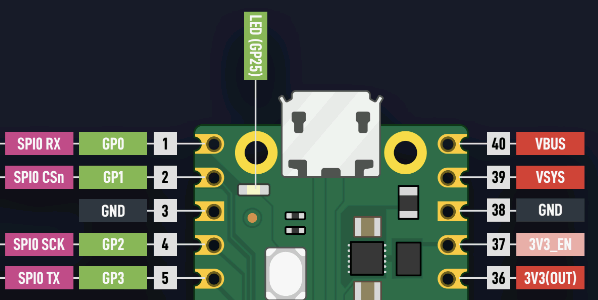

# Lampjes knipperen

Tot nu toe hebben we de microcontroller code laten uitvoeren en een resultaat terug laten sturen, zou het niet leuker zijn als we ook iets fysieks zien gebeuren? Dit word de eerste stap, tijd om een LED te laten knipperen!

!!! note "Houd je muis boven een term met een gestippelde onderlijning om meer informatie te krijgen"

## De theorie

De Raspberry Pico heeft standaard een LED ingebouwd:

<figure markdown="1">
{: style="max-height:300px"}
<figcaption>Locatie van LED op de microcontroller</figcaption>
</figure>

Voordat we deze LED aan en uit kunnen zetten moeten we het concept van `Pinnen / een Pin` begrijpen.

Wat je voor je hebt liggen is meer dan alleen een microcontroller, er zit namelijk een heel board met extra electronica om heen. Alleen de "grote" zwarte chip in het midden is de microcontroller, de rest zijn extra's of benodigde elektronische componenten voor bijvoorbeeld de stroom voeding.

Op een chip zitten vaak veel pinnetjes, dit zijn vaak in-/uitgangen voor een signaal (zoals het aanzetten van een LEDje) of voor stroom (de + en de -). In de onderstaande afbeelding zijn deze pinnen erg goed te zien.

<figure markdown="1">
{: style="max-height:300px"}
<figcaption>Close-up van een chip</figcaption>
</figure>

Op het microcontroller boardje dat voor je ligt kan je vanuit de chip verschillende lijnen zien lopen naar - bijvoorbeeld - de gouden pinnen aan de zijkant van het board, maar ook naar de LED.  
De gouden pinnen aan het zijkant van het board maken het makkelijker om te gebruiken, in tegenstelling tot de bijna microscopische pinnen op een chip.

## Informatie achterhalen

Omdat een microcontroller veel verschillende functionaliteiten op de pinnen heeft moeten we goed kijken welke we gaan gebruiken. Veel van deze informatie staat op een "pin-map" of "pinout diagram". Gelukkig biedt je ontwikkelomgeving zo een diagram aan:

1. Klik CTRL+SHIFT+P, dit opent een "commando" scherm in je omgeving, door wat termen te typen die lijken op wat je wilt doen krijg je alle soortgelijke functionaliteiten van je omgeving te zien.
2. Begin met het typen van: "pico pin map" of "pin map" of "pico". Zoals je waarschijnlijk kan zien krijg je een lijst met commandos/functies van je ontwikkelomgeving.
3. Gebruik je muis of de pijltjestoetsen + enter om de juiste functie te selecteren.  
   In dit geval moeten we hebben: `Pico-Go > Help > Show Pico Pin Map`

<figure markdown="1">
{: style="max-height:300px"}
<figcaption>Commando om de Pin-Map te laten zien</figcaption>
</figure>

Eenmaal geklikt op het juiste commando zul je een nieuwe tabblad krijgen met een pin-diagram van je microcontroller board. Hier staat veel informatie in, maar voor nu zijn we geintereseerd in het bovenste label met: "LED (GP25)".

<figure markdown="1">
{: style="max-height:250px"}
<figcaption>Raspberry Pico Pin-Map</figcaption>
</figure>

Elk groene label is in de vorm van `GPxx` waarbij `xx` een getal is. Dit is het nummer voor algemeen gebruik, of in het engels "**G**eneral&nbsp;**P**urpose". Dit betekend niks meer dat we zelf deze pin aan en uit kunnen zetten.  
Voor het aansturen van de LED gebruiken we dus GP25.

## Aansturen van pinnen (en de LED)

Om een Pin aan te sturen in de code moeten we wat externe functionaliteit importeren. Veel functies rondom het microcontroller boardje bevind zich in de `machine` module. Deze kan geimporteerd worden via `#!python import machine` of een specifieke functie via `#!python from machine import <functie>`.

Open het volgende workshop bestand: **4_blink.py**

```py title="4_blink.py"
from machine import Pin
led = Pin(25, Pin.OUT)
led.on()
```

Als we deze code regel voor regel "vertalen" naar het nederlands krijgen we:

1. `van de module machine, gebruik de Pin functionaliteit.`
2. `variabele led is een Pin met parameters 25 (GP25) en deze pin is een output.`
3. `van de variabele led, voer de functie on() uit.`

!!! note "Bij een output sturen wij het signaal aan (aan/uit), bij een input lezen we het signaal uit"

!!! note "klassen en objecten"
    Tot zo ver hebben we variabelen gehad met een "primitieve" waardes: een getal, een stuk tekst of een decimaal getal.

    Naast primitieven zijn er ook klassen en objecten dit kan je zien als een groep aan data en functies in één variabele. Het aanroepen van `#!python Pin(25, Pin.OUT)` geeft een object terug die geconfigureerd staat om GP25 te besturen als OUTPUT. Daarnaast heeft dat object ook extra functies zoals `on()`, `off()`, `high()`, `low()` en `toggle()`.

!!! question "Oefening A: Knipperen"
    Naast de `machine` module wordt er in jouw workshop code ook een andere functie geimporteerd uit een andere module. Lees hiervan de beschrijving door er met je muis over te hangen (en/of lees de comment erboven).

    Kan je met behulp van de functies op het `led` object het LEDje laten knipperen (aan/uit/aan/uit/etc...)?


*[LED]: Een Light-Emitting-Diode, simpelweg een lampje!
*[Raspberry Pico]: Het microcontroller boardje dat met USB aan je computer zit.
*[GP25]: "General Purpose" pin. Deze pinnen kunnen we zelf aansturen. GP25 is verbonden aan de LED.