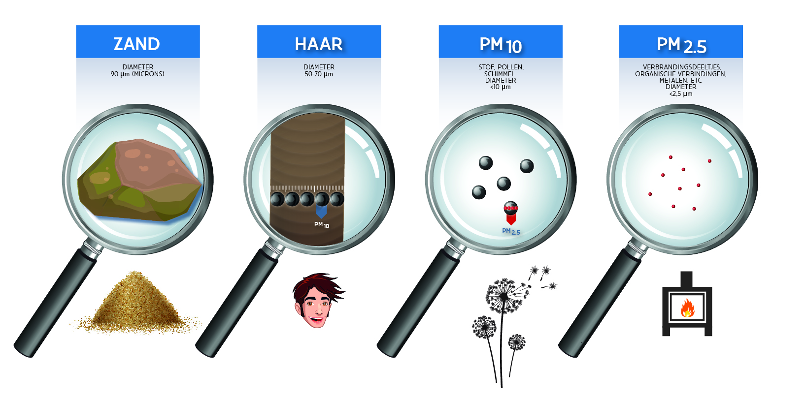
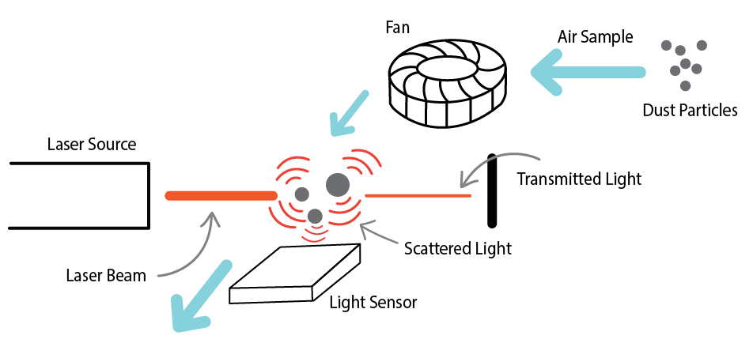

# Fijnstof

Zoals je bij de introductie hebt gelezen gaan we fijnstof meten met behulp van de SPS30 sensor. Deze pagina gaat kort in op wat fijnstof is en hoe we het gaan meten. Door een stukje van deze theorie te begrijpen kunnen we straks de fijnstof sensor goed testen.

## Wat is fijnstof?

Fijnstof zijn ontzettend kleine deeltjes van een paar micrometer (dat is 0.000001 meter of 0.001 millimeter). Deze kleine deeltje kunnen invloed hebben op je gezondheid. Over het algemeen hangt luchtverontreiniging en de concentratie fijnstof samen. De grootste bron van fijnstof is het dagelijks verkeer. Dit draagt tot wel een derde bij aan alle fijnstof emissie in Nederland. [^1] Zoals je kan verwachten is het inademen bij de uitlaat van een brandstof-auto niet de prettigste ervaring en zeker niet een gezonde.

De concentratie fijnstof geeft dus een goede indicatie van de luchtkwaliteit in een gebied. De grootte van fijnstof kan ook nog verschillen. In deze workshop gaan we de concentratie van 2.5 micrometer deeltjes meten. 

<figure markdown="1">

<figcaption>Grootte van fijnstof (bron: hoemeetiklucht.eu)</figcaption>
</figure>

## Hoe wordt fijnstof gemeten

Hoe de sensor precies werkt is te complex om uit te leggen in deze workshop, maar met het onderstaande figuur kan je een idee krijgen. Het proces gaat in drie stappen: allereerst moet er een kleine luchstroom zijn om buitenlucht in de sensor te krijgen. Vervolgens gaat deze lucht met fijnstof deeltjes langs een lichtstraal; de laser. Naast het pad van de laser staat een erg gevoellige lichtsensor. De fijnstof deeltjes zullen de lichtstraal verstrooiien waardoor het opgevangen kan worden met de lichtsensor. Door deze verstrooiing kunnen de fijnstof eigenschappen in de lucht gemeten worden.  
    Naast deze methode van meten zijn er ook nog andere methoden, die wellicht goedkoper of meer accuraat zijn.

<figure markdown="1">

<figcaption>
    Hoe fijnstof gemeten kan worden met een laser 
    Bron: <a href="https://archive.thepocketlab.com/educators/lesson/pocketlab-air-measuring-particulate-matter">The pocket lab</a>
</figcaption>
</figure>

## Hoe gaan wij fijnstof meten?

Voor het meten van fijnstof gaan we gebruik maken van een sensor, namelijk de Sensirion SPS30 sensor. Dit is een klein groen kastje dat van binnen gebruik maakt van een kleine ventilator en laser om te meten hoeveel fijnstof er in de lucht zit. Het is aan ons om commando's naar de sensor te versturen en resultaten uit te lezen. 

<figure markdown="1">

<figcaption>De SPS30 fijnstof sensor</figcaption>
</figure>

[^1]: Bron: https://www.rivm.nl/fijn-stof/emissies