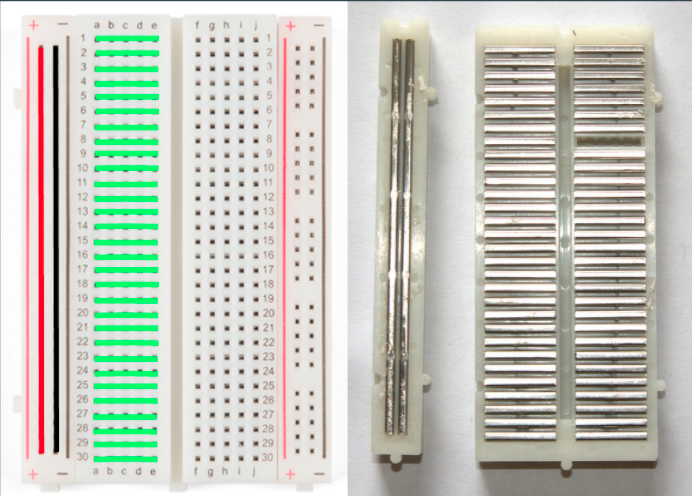
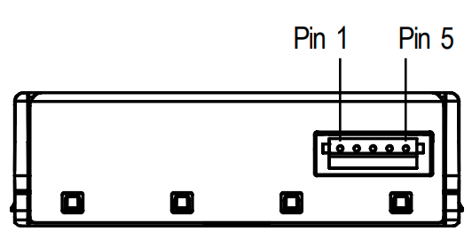
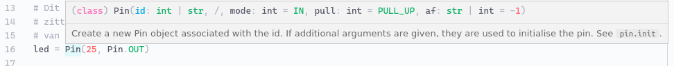

# Communicatie met de sensor

Op een manier moeten we data naar de sensor sturen en een reactie - zoals meetresultaat - kunnen ontvangen. Zoals je eerder - bij het hoofdstuk over het LED lampje - hebt geleerd kunnen we een aan of uit signaal versturen. Op deze manier zou je bijvoorbeeld morse code kunnen versturen, maar dat kan efficienter.

<figure markdown="1">
{width=700}
<figcaption>Communicatie tussen de microcontroller en sensor</figcaption>
</figure>

Een betere manier dan morse om data te versturen via digitale signalen kan met UART. Hiermee kunnen we met twee kabels, die de microcontroller verbindt aan de sensor, data ontvangen(RX) en versturen(TX)[^1]. Uiteindelijk komen de meeste manieren van digitale communicatie neer op aan en uit, 1 en 0 of hoog en lage spanningen. Een UART bericht kan je zien in het diagram hieronder.

Om het UART protocol zelf te implementeren is vrij complex. Gelukkig heeft onze microcontroller al een aantal protocollen ingebouwd, waaronder UART. Het enige wat wij moeten doen is de sensor goed aansluiten met de kabeltjes en de microcontroller zo programmeren dat het UART gaat gebruiken.

??? note "UART iets verder uitgelegd"
    In het diagram hieroner kan je de stroom op een van de data kabels zien over een bepaalde tijd (op de horizontale as). Het hele bericht dat je ziet noemen we een "frame". Een frame heeft een begin en een einde. In dit geval is het begin de "start bit", dus een laag signaal voor een bepaalde tijd. Dit wordt gevolgd door 8 data bits en met twee stop bits. De stop bits indiceren het einde van de frame.

    De "Parity bit" is een simpele manier om te zien of er een fout is tijdens de communicatie. De parity bit geeft aan of er een even of oneven aantal 1'tjes in de frame zitten. Mocht er dan een frame ontvangen zijn en de parity-bit klopt niet, dan weten we dat er iets fout is gegaan tijdens het ontvangen.

    <figure markdown="1">
    {width=1000}
    <figcaption>Hoge en lage spanningen vormen een bericht in UART</figcaption>
    </figure>


## Breadboard aansluiting

!!! warning "Let op!"
    Het is handig om te weten hoe deze opstelling werkt, maar deze stappen hoef je **niet**  te volgen als jouw sensor al is aangesloten

Voor het aansluiten van de sensor aan de microcontroller gaan we gebruik maken van een breadboard met jumpers (kabeltjes).

Met een breadboard kunnen we de pinnen van de microcontroller verbinden aan de pinnen van de sensor, zonder permanente aansluitingen te maken. Hiervoor moet je wel weten hoe een breadboard in elkaar zit.

Een breadboard bestaat uit rijen (horizontaal) en kolommen (verticaal). Zoals het diagram hieronder laat zien is elke rij met elkaar verbonden. Hiermee kunnen we dus tot 5 kabels met elkaar verbinden per rij. De enige uitzondering hierop is de + en - kolom die verticaal met elkaar verbonden zijn.

!!! note "Tip"
    De microcontroller past precies in het midden de breadboard waardoor je makkelijk de pinnen van de microcontroller kan verbinden met de sensor.

<figure markdown="1">
{width=700}
<figcaption>De voor- en achterkant van een breadboard laat zien hoe de pinnen verbonden zijn met elkaar</figcaption>
</figure>

## Sensor aansluiting

De microcontroller heeft UART ingebouwd waar we gebruik van kunnen maken. Deze UART zit verbonden op bepaalde pinnen. Als je de Pin-Map weer opened kan je deze herkennen door het (licht)paarse label waarin staat "UART0" of "UART1". Hier is UART genummerd omdat we meerdere UART communicaties tegelijk kunnen hebben met verschillende sensoren/apparaten. Later in deze workshop gaan we de radio module ook via UART aanspreken.

!!! note "Microcontroller pin-map openen"
    1. Klik op CTRL+SHIFT+P
    2. Typ: 'pin map'
    3. Klik op het resultaat

Naast de pinmap van de microcontroller, moet je ook weten wat elke pin van de sensor doet. De pinmap van de sensor kan je in het diagram hieronder zien. Let op dat de groene kant van de sensor beneden zit.

<figure markdown="1">
{width=400}
<figcaption>De pinmap van de SPS30 fijnstof sensor</figcaption>
</figure>

Hieronder staat een tabel met de verbinding van de microcontroller naar de sensor. Gebruik de pinmap van de microcontroller en de sensor om te begrijpen hoe ze met elkaar verbonden zijn. Mocht de sensor nog niet verbonden zijn met de microcontroller, doe dat dan nu.

!!! error "Sensor kapot!?"
    Eigenlijk kan je bijna niks kapot maken tijdens het schrijven van code. Dit is de enige stap waar je extra goed moet opletten. Als je per ongeluk de stroomvoeding en de stroomgrond (de + en de -) door elkaar haalt gaat de sensor gegarandeerd kapot en kan je niet verder met de workshop.

<figure markdown="1">
| Microcontroller pin (GPxx) | Sensor pin | Omschrijving                               |
| -------------------------- | ---------- | ------------------------------------------ |
| VSYS                       | +5V/VDD    | De stroomvoeding voor de sensor            |
| GND                        | GND        | Stroom grond                               |
| UART1 TX (GP4)             | RX         | Data vanuit microcontroller naar de sensor |
| UART1 RX (GP5)             | TX         | Data vanuit sensor naar de microcontroller |
</figure>

## Code schrijven

De sensor is via draadjes verbonden met de microcontroller, maar nu moeten we code schrijven zodat de microcontroller begrijpt dat de SPS30 sensor verbonden zit via UART communicatie. Hiervoor moet je het volgende weten, dit staat ook eerder op deze pagina uitgelegd:

- We gebruiken UART nummer 1
- UART TX (verzend) pin is GP4
- UART RX (ontvang) pin is GP5
- De sensor heet de SPS30
- We moeten met een snelheid van 115200 bits per seconden data versturen/ontvangen [^2]

Open het workshop bestand genaamd: **5_sps30.py**. Lees dit bestand even door en let op hoe de UART verbinding wordt opgezet. Net als bij `Pin` importeren we extra functionaliteit `UART`. Vervolgens maken we 2 pinnen aan, dit zijn de UART1 TX en RX pin. Deze pinnen gebruiken we weer om een UART object aan te maken.

```py
from machine import UART, Pin
from lib.sps30 import SPS30

tx_pin = Pin(4)
rx_pin = Pin(5)
verbinding = UART(id=1, baudrate=115200, tx=tx_pin, rx=rx_pin)

sensor = SPS30(verbinding)
serienummer = sensor.serie_nummer()
print(serienummer)
```

??? warning "Ik krijg geen reactie...?"
    Het kan voorkomen dat je de code uitvoert en geen reactie krijg, dan zie je alleen het volgende:

    ```
    >>> 

    >>> 
    ```

    In dit geval zal er ergens een communicatiefout zijn opgetreden. Dit kan gebeuren omdat werken met jumpers (draadjes) niet altijd even stabiel is. 

    Probeer nog een aantal keer op "Run" te klikken. Als het daarna nog niet werkt, vraag dan een van de begeleiders om hulp.

??? note "Parameter namen gebruiken"
    Zoals je wellicht is opgevallen, bij het maken van het UART object zetten we de parameters niet op volgorde maar specificeren we welke parameter we een waarde willen geven.
    
    Bij het Pin voorbeeld zie je alleen 4 als parameter. Echter, als je met je muis over het woord `Pin` hangt dan zal je onwtikkelomgeving een popup laten zien met extra informatie, zoals de parameter namen. Deze informatie kan je ook zien als je over `UART` hangt met je muis.

    <figure markdown="1">
    
    <figcaption>Omschrijving en parameter namen van het Pin object</figcaption>
    </figure>

    In eerste instantie ziet de omschrijving er complex uit, maar let vooral op de woorden tussen de haakjes en voor de dubbele punt `:`. De namen van de parameters van het Pin object zijn in volgorde: `id`, `mode`, `pull` en `af`.

    Als je niet specifiek de naam van de parameter opgeeft zoals `#!python led = Pin(25, Pin.OUT)` dan wordt de volgorde in de omschrijving aangehouden. Dus de parameter met de naam `id` is in dit geval 25 en `mode` is `Pin.OUT`. 
    
    Als je wel de naam van de parameters opgeeft, ziet dat er als volgt uit: `#!python led = Pin(mode=Pin.OUT, id=25)`. Je hoeft dan ook de volgorde niet aan te houden.

!!! question "Vraag A: Klopt het serienummer"
    Zoals je in de code ziet, we voeren een functie uit op het sensor object genaamd `serie_nummer()`. Achter de schermen gebruikt deze functie de UART verbinding om aan de SPS30 te vragen wat zijn serie nummer is.

    Het serienummer van de SPS30 staat ook op een label op de groene kant van de sensor. Komen deze serie nummers overeen?

!!! question "Oefening B: Zien wat er achter de schermen gebeurd?"
    Wanneer het SPS30 object wordt gemaakt geef je 1 parameter mee, dat is de UART verbinding (zie regel 8). Echter, de bij het aanmaken van het SPS30 object kan je ook een tweede parameter meegeven dat een boolean is (`#!python True` of `#!python False`). Deze tweede parameter heeft de naam `debug`. Dit staat standaard uit, maar als je het aan zet zal de microcontroller meer informatie terugsturen naar je computer. Hierin zie je ook de data die de microcontroller stuurt en ontvangt via UART.

    ```py
    sensor = SPS30(verbinding, True)
    ```

!!! question "Oefening C: Verder kijken"
    Eerder heb je geleerd dat de ontwikkelomgeving suggesties en aanvullingen kan geven. Als je `#!python sensor.` typt, zie je dan al interessante functies?

*[UART]: Universal Asynchronous Receiver Transmitter; een manier om data te versturen en ontvangen
*[TX]: Transmit; het versturen van data
*[RX]: Receive; het ontvangen van data
*[bit]: Een bit is een 1 of 0. Acht bits samen vormt een byte.
[^1]: Er zijn ook manieren om op slechts 1 kabel zowel data te versturen als ontvangen, dit heet "half-duplex"
[^2]: Dit is een van de standaard snelheden. Een andere bekende snelheid is: 9600