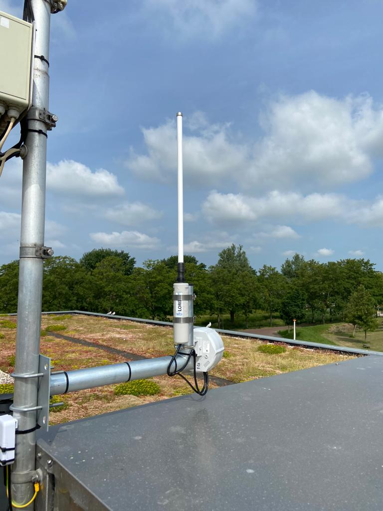

# LoRa(WAN) verbinding

Nu het gelukt is om de sensor uit te lezen, willen we deze metingen verzenden naar het internet. Het liefst zonder een kilometer aan internetkabel en zo energie zuinig mogelijk. Hiervoor is LoRa een perfecte match!

LoRa is een techniek om draadloos data te versturen op lange afstand, net als WiFi en je 3g/4g/5g. LoRa gebruikt minder stroom en kan op langere afstand data versturen (enkele kilometers tot tientallen kilometers), het nadeel is dat het - vergeleken met wifi en een mobiel netwerk - ontzettend traag is. Een 1 minuut youtube video is ongeveer 50MB (dat is 50.000.000 bytes) en duurt ongeveer 10 uur om te versturen over LoRa. Echter, een meetwaarde is vaak maar een paar bytes en kan dus makkelijk verstuurd worden.

Maar enkel met LoRa zijn we er niet. Een LoRa bericht kan namelijk alleen door een LoRa ontvanger ontvangen worden en kan dus niet bij het internet. De oplossing hiervoor is een apparaat dat aan de ene kant een LoRa ontvanger heeft en aan de andere kant een internet verbinding. 

<figure markdown="1">
{width=700}
<figcaption>Verbindingen van een LoRa apparaat naar het internet</figcaption>
</figure>

!!! note "LoRa vs. LoRaWAN"
    LoRa is de technologie om draadloos data te versturen, wanneer we LoRa gebruiken in combinatie met gateways en een internet server noemen we het LoRaWAN wat staat voor: **Lo**ng **Ra**nge **W**ide **A**rea **N**etwork.

    Zoals je in het diagram hierboven kan zien wordt de LoRa techniek gebruikt om data te versturen naar Gateways. Het hele systeem samen wordt LoRaWAN genoemd.

Met behulp van Gateways kunnen we LoRa berichten ontvangen en doorsturen naar het internet. Voordat de berichten via het internet bij jou aankomen moeten ze eerst ontsleuteld worden en gevalideerd, dit gebeurd via een netwerk server. In het diagram hierboven kan je zien dat het TheThingsNetwork is.

Om een dekkend netwerk te hebben moeten er dus veel van deze Gateways geplaatst zijn die samenwerken. Gelukkig is er het TheThingsNetwork. Dat is een LoRa netwerk met duizenden vrijwilligers die zo een gateway hebben geplaatst in hun huis, boven op hun dak of zelfs op vuurtorens en windturbines!

Ook het Goese Lyceum en Pieter Zeeman Lyceum dragen bij aan het netwerk via een gateway.

<figure markdown="1">
|                                   |                                                              |
| --------------------------------- | ------------------------------------------------------------ |
|  |  |
</figure>

## Beveiliging

Maar als iedereen via LoRa je berichten kan ontvangen, hoe is dit dan veilig? Kunnen anderen niet meeluisteren? Als je LoRaWAN gebruikt met een netwerk dan wordt al je data versleuteld zodat niemand kan meelezen. Alleen jij - want jij hebt de sleutel - kan deze data ontsleutelen en gebruiken.

Elke node (apparaat dat LoRaWAN gebruikt) heeft een eigen uniek identificatie nummer en sleutels. Een sleutel is in principe een wachtwoord om je data te beveiligen. De namen van deze identificatie nummers en sleutels zijn als volgt:

- DevEUI; uniek node identificatie nummer.
- JoinEUI; identificatie nummer voor het netwerk waarmee je verbind. In ons geval is dit 16x '0'.
- AppKey; de geheime sleutel om je data mee te beveiligen.