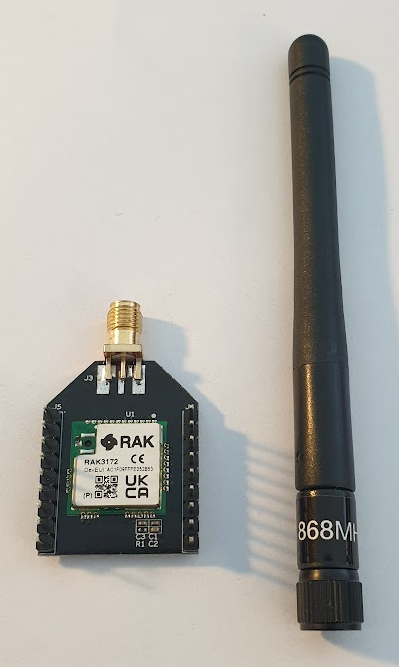
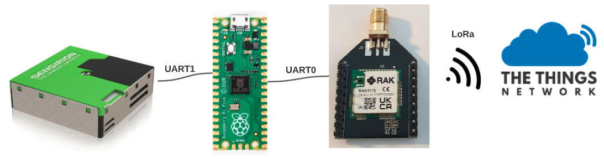

# LoRaWAN gebruiken

Voor het verbinden en versturen van data via LoRaWAN gebruiken we de RAK3172 module. Deze module communiceert ook via UART, de microcontroller heeft nog een extra UART port over die we hiervoor gaan gebruiken, namelijk UART0.

<figure markdown="1">
{: style="max-height:400px" }
<figcaption>De RAK3172 LoRaWAN module</figcaption>
</figure>

## Module aansluiten

Net als bij de fijnstof sensor moeten we deze module aansluiten aan de microcontroller. Gebruikt hiervoor weer de pin-map van de pico. De pin map van de LoRaWAN module staat op de module zelf, kijk maar eens!

Met behulp van de pin maps kan je de volgende verbinding gaan maken:

<figure markdown="1">
| Microcontroller pin (GPxx) | Module pin | Omschrijving                                       |
| -------------------------- | ---------- | -------------------------------------------------- |
| VSYS                       | +5V/VDD    | De stroomvoeding voor de LoRaWAN module            |
| GND                        | GND        | Stroom grond                                       |
| UART0 TX (GP0)             | RX         | Data vanuit microcontroller naar de LoRaWAN module |
| UART0 RX (GP1)             | TX         | Data vanuit LoRaWAN module naar de microcontroller |
</figure>

!!! tip "Een refresher nodig?"
    Kijk eens bij het hoofdstuk: [Praten met de sensor](./uart.md), om te zien hoe het opzetten van de verbinding werkt. Let wel op dat je UART1 met UART0 vervang en de juiste pinnen gebruikt.

Uiteindelijk ziet je opstelling er als volgt uit:


<figure markdown="1">
{ width=700 }
<figcaption>Het hele systeem</figcaption>
</figure>

## Code schrijven

!!! tip "LoRaWAN sleutels krijgen"
    Om een LoRaWAN verbinding te krijgen heb je de sleutels nodig die in het vorige hoofdstuk besproken zijn (DevEUI, JoinEUI en AppKey).

    Vraag aan de workshopbegeleider om deze sleutels en zeg daarbij de groepsnaam die je helemaal in het begin van de workshop hebt ingevuld tijdens het maken van een verbinding. De begeleider zal verbinding maken met je omgeving en de sleutels erin plakken.

Open het workshop bestand: **7_rak3172.py**. Lees de comments goed door, daar staan al ontzettend veel tips in!

```py
from machine import UART, Pin
from lib.rak3172 import RAK3172

verbinding = UART(id=0, baudrate=9600, tx=Pin(0), rx=Pin(1))
lora = RAK3172(verbinding)

# Zelf aanvullen
```

Deze code lijkt erg veel op die van het uitlezen van de sensor, alleen deze keer gaan we niks uitlezen maar data versturen. Maak gebruik van je ontwikkelomgeving om erachter te komen welke functies het `lora` object heeft.

## Hoe weet ik of LoRaWAN werkt?

Wanneer je de `#!python lora.verbind(..)` functie gebruikt zal je LoRaWAN module gaan proberen te verbinden met het TheThingsNetwork. De functie zelf zal `True` of `False` teruggeven als het gelukt of niet-gelukt is. Ook op de TheThingsNetwork webpagina kan je zien of je node verbindt, vraag aan een begeleider om dit op het scherm te zetten.