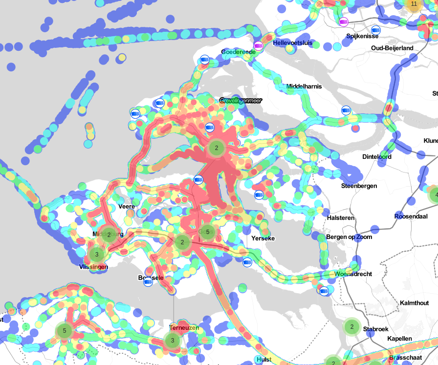
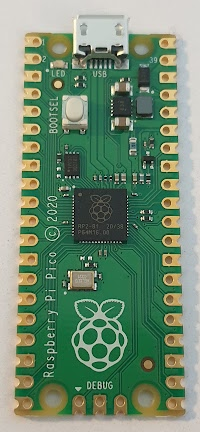
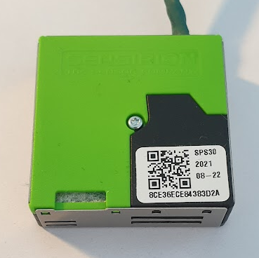
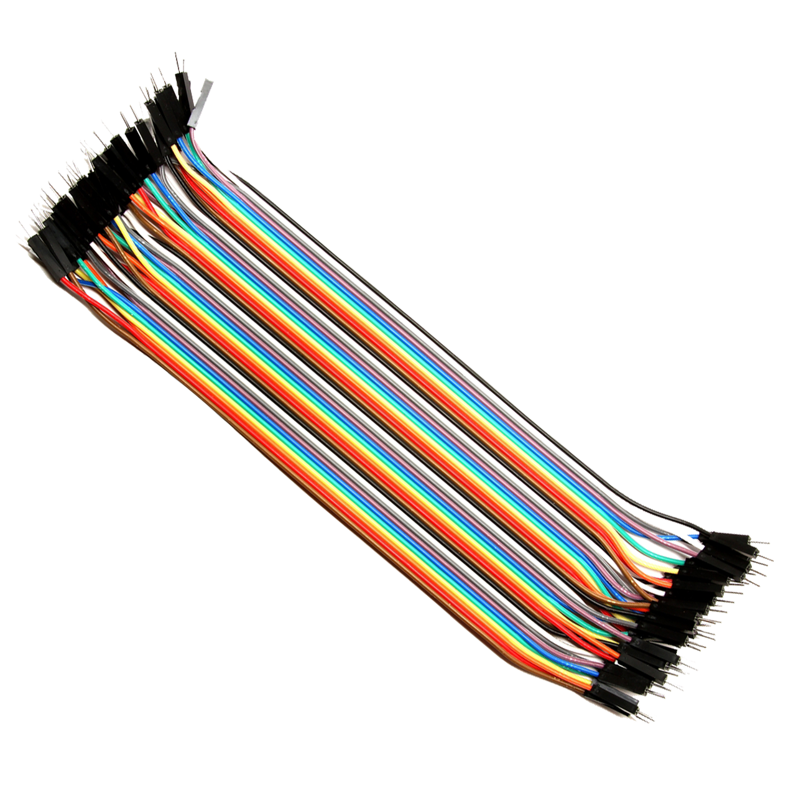
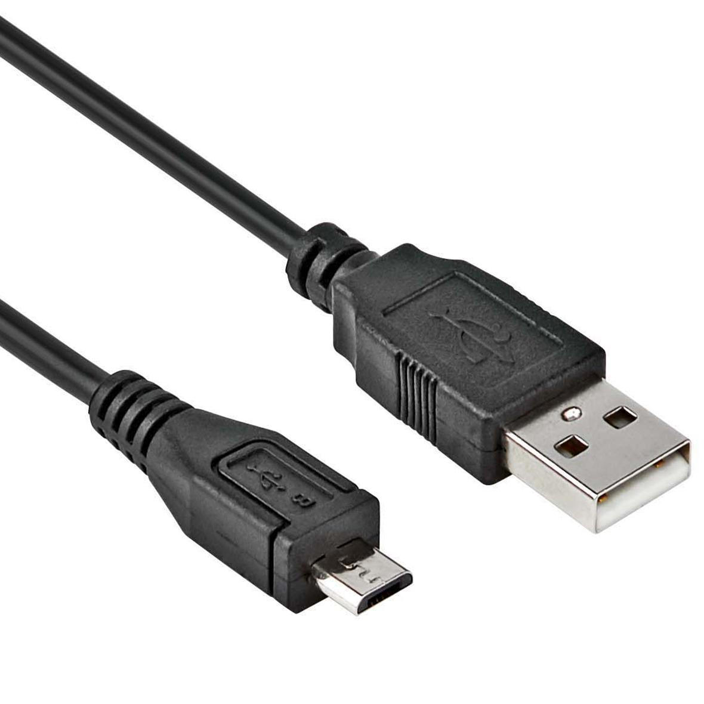
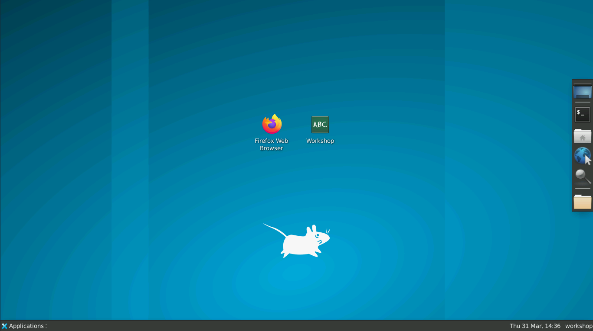

# Workshop: IoT fijnstof sensor

In de workshop "IoT fijnstof sensor" gaan we met behulp van een microcontroller, sensor en radiomodule een draadloos meetapparaat maken dat elke 10 seconden een meting doet en data doorstuurt.

Voor het versturen van data maken we gebruik van het LoRaWAN netwerk. Samen met duizenden vrijwilligers is er een gratis netwerk opgezet om data te versturen en ontvangen, dit is het TheThingsNetwork. De Provincie Zeeland en het Waterschap Scheldestromen hebben gezamelijk een Zeeland dekkend netwerk gemaakt.

<figure markdown="1">
{width=600}
</figure>

Ook het Goese Lyceum en Pieter Zeeman Lyceum dragen bij aan het netwerk via een ontvanger.

<figure markdown="1">
|                                   |                                                              |
| --------------------------------- | ------------------------------------------------------------ |
|  |  |
</figure>

## Benodigdheden

Zorg dat je de volgende materialen bij de hand hebt. Klik op de tabbladen onder de lijst om een foto bij het item te zien.

1. **Microcontroller** (Raspberry Pico)
2. **Radio module** (RAK3172 LoRaWAN Module)
3. **Fijnstof sensor** (SPS30 sensor)
4. **Breadboard**
5. **Kabeltjes** (Jumpers)
6. **USB-Kabel**

=== "Microcontroller"
    <figure markdown="1">
    {: style="max-height:300px"}
    </figure>
=== "Radio module"
    <figure markdown="1">
    {: style="max-height:300px"}
    </figure>
=== "Fijnstof sensor"
    <figure markdown="1">
    {: style="max-height:300px"}
    </figure>
=== "Breadboard"
    <figure markdown="1">
    {: style="max-height:300px"}
    </figure>
=== "Kabeltjes"
    <figure markdown="1">
    {: style="max-height:300px"}
    </figure>
=== "USB Kabel"
    <figure markdown="1">
    {: style="max-height:300px"}
    </figure>

## Online werkplek

Om te zorgen dat iedere deelnemer in dezelfde soort omgeving werkt en niks hoeft te installeren worden er online computers voorzien. Je hoeft zelf alleen een ondersteunde browser te hebben. [^1]

De workshopbegeleider zal je voorzien van een link naar deze omgeving met een workshopcode. Voordat de omgeving opent moet je ook een naam kiezen. Dit is je groepsnaam en kan worden gebruikt om ondersteuning te vragen en om met meerdere mensen in één omgeving te werken.

## Verbinden met online werkplek

!!! info "Meerdere verbindingen"
    Meerdere mensen op jouw online omgeving? Gebruik dezelfde groepscode, maar houdt CTRL ingedrukt bij het klikken op "Connect". Hierdoor is er niet nog een microcontroller vereist en dit voorkomt fouten.

Na het invullen van de workshopcode en je groepsnaam krijg je een wit scherm te zien met een groene "Connect" knop. Voordat je op deze knop druk moet de microcontroller via USB verbonden zijn aan je computer.

Zodra je op de "Connect" knop klikt zal er een kleine popup verschijnen die vraagt verbinding te maken met een apparaat. Er hoort slechts één apparaat in de lijst te staan dat lijkt op "Board in FS Mode". Dat is de microcontroller, selecteer deze en klik op OK. Als alles goed gaat zal krijg je een bureaublad te zien.

<figure markdown="1">
{ width="400" }
<figcaption>Popup om te verbinden met de microcontroller</figcaption>
</figure>

<figure markdown="1">

<figcaption>De online werkplek</figcaption>
</figure>

!!! note "Volgende stap"
    Onderaan de pagina in de zwarte balk staat een knop om naar de volgende stap/opdracht/pagina te gaan.

[^1]: Momenteel worden alleen de Chrome en Edge browser ondersteund